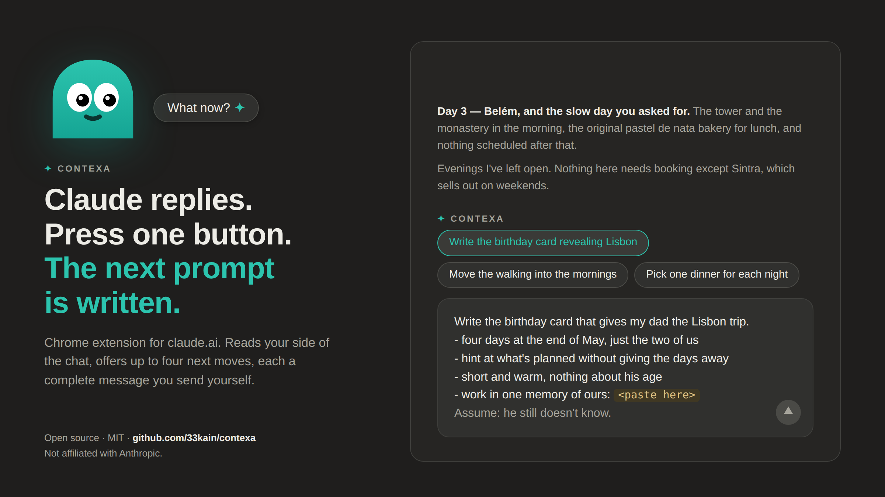

# CONTEXA

[](https://github.com/33kain/contexa/actions/workflows/ci.yml)

**CONTEXA reads where your conversation has been going and writes the messages
you could send next — as a menu you pick from with one click.**



CONTEXA is a Chrome extension for claude.ai. When Claude finishes a reply, a
single chip appears above your message box. **Nothing happens until you click
it** — no model call, and nothing about your conversation leaves the page. Click
it and CONTEXA reads **your own messages from this session**, works out what you
have been building toward, and offers up to four next moves. Each is already a
complete message. Click one and it lands in your message box, whole. You read it,
change anything, and send it yourself. Nothing is ever sent for you.

The moves are **independent**. Each stands alone as a full request, none depends
on the others, and picking one discards the rest — a menu, not a sequence. Every
move must be earned by something actually said in the session; **no quotable
evidence, no move.** A session with nothing open earns nothing, and no row is
drawn at all. That is a correct outcome, not a failure.

Claude's latest reply is read too, but as **material** rather than as the
subject: what it just built is what makes a new move possible. CONTEXA never
sends you back over an answer you have already read.

No account, no API key, free to use. Nothing overlays your composer, nothing
scores your writing, and nothing appears unless it's real.

---

## Why it exists

Vague prompts get vague answers, and writing specific prompts is a skill. The
audience is people who are already using Claude every day and are not
developers — *"make bad prompts good"* is worth nothing to someone whose prompts
are already good.

So CONTEXA doesn't grade your writing. It reads the conversation you're already
in, works out where it has been heading, and turns that into a menu of things you
could ask for next. Each written prompt is detailed — it names the deliverable,
the format, the length, the constraint — and **the message box is the disclosure
surface:** you always see the full text before anything is sent.

## Repo layout

```
extension/    Chrome extension (Manifest V3) — this is the product
worker/       Cloudflare Worker backend — proxies to Anthropic, enforces quotas
publishing/   Chrome Web Store listing copy, privacy policy, screenshots, checklist
```

## How it works

```
claude.ai reply finishes
   └─ content.js detects [data-is-streaming] flipping to false
        └─ captures the reply, and STOPS
             └─ renders one chip. No model call. Nothing sent.

you click the chip
   └─ content.js reads your own messages from the session, live off the DOM
        └─ turns[] + the reply go to the backend
             └─ Worker adds the system prompt, calls Anthropic, enforces quota
                  └─ moves earned → a flat row of up to four
                     nothing      → no row at all
                       └─ you click one; its whole prompt lands in the box
```

**The reply capture is eager; the session read and the call are not.** Reading
one reply costs nothing and the DOM is settled the moment it completes, so that
happens immediately. The session is the larger read and it waits for the click,
along with the model call — the part that costs money and sends data.

Two modes:

- **Hosted (default)** — the Worker holds the API key, so users need no setup.
  Fair-use limit of **20 replies a day** per device — `REPLIES_PER_DAY` in
  `worker/src/index.js`, which is the one figure safe to quote in public copy.
  One click on the chip spends one; picking a move costs nothing, because the
  message is already written. The unit is *replies asked about*, not prompts: a
  single call returns up to four prompts and you may take one, several or none.
- **Own API key (optional)** — set it in the extension's options to remove the
  limit. Requests then go straight from the browser to Anthropic, bypassing the
  Worker entirely.

## Install the extension (development)

1. `chrome://extensions` → enable **Developer mode**
2. **Load unpacked** → select the `extension/` folder
3. Open claude.ai and send a message

Chrome will warn that it "can't verify where this extension comes from." That's
expected for unpacked extensions and only goes away when installing from the
Chrome Web Store.

**Reloading the extension does not update open tabs.** Reload it, then Ctrl+R
every claude.ai tab, or you are testing an orphaned copy of the old build. The
mount log says which version you are actually running:

```
[CONTEXA] card mounted v0.9.68 ai anchor top=… bottom=… viewport=… connected=…
```

`v?` there means an orphaned script. Two mount lines with different versions
means two builds installed at once.

## Deploy the backend

Full instructions in [`worker/README.md`](worker/README.md). Short version:

```bash
cd worker
npx wrangler login
npx wrangler kv namespace create CX_KV     # paste the id into wrangler.toml
npx wrangler secret put ANTHROPIC_API_KEY  # value goes in at the prompt
npx wrangler secret put IP_SALT
npx wrangler deploy                        # secrets FIRST: deploying without the
                                           # key leaves a live worker that reports
                                           # configured:false and refuses every call
curl https://YOUR-WORKER-HOST/v1/health
# {"ok":true,"version":"0.9.68","model":"claude-sonnet-5","limit":20,"configured":true}
# `limit` is the device ceiling, which is now also the public figure: one call per
# reply. Read `version` and `limit` together — they are how you tell a deploy that
# landed from one that no-opped, and a stale worker still answers 200.
```

On Windows PowerShell use `npx.cmd` and `curl.exe`, and generate the salt with
`[guid]::NewGuid().ToString('N')`.

Then set `DEFAULT_PROXY_URL` in `extension/background.js` and the matching entry
in `extension/manifest.json`'s `host_permissions`.

### Secrets

The Anthropic key lives **only** in Cloudflare's encrypted secret store — never
in this repo, never in the extension. `wrangler secret put` takes the secret
*name* as its argument and the *value* at a hidden prompt; inverting those two
creates a secret literally named after your key, so prefer the Cloudflare
dashboard (**Settings → Variables and Secrets**) where the field is visible.

## Cost and abuse controls

**Cost scales with asks, not with replies.** Before the on-demand change every
completed reply spent a call whether or not anyone looked at it, so a long
conversation could exhaust a day's free tier without a single click. Now nothing
is spent until someone asks, which is the only place the spend was ever buying
anything. Mining also removed the second call a finished prompt used to
cost — the moves arrive already composed, so clicking one spends nothing.

Built-in protections:

- 20 requests/day per device token (= `REPLIES_PER_DAY`, one call per reply
  asked about), 200/day per hashed IP (= the device ceiling × 10). Both are
  derived from one another in `worker/src/index.js` rather than written down
  separately, because the last time they were separate literals the ratio
  silently halved when the device ceiling moved.
- Server-side input clamping (≤40 turns, ≤2,000 chars each, ≤12,000 total, reply
  ≤6,000, fixed `max_tokens`) — a modified client cannot make a request cost
  more. These are the bill's ceiling, deliberately separate from the client's
  own capture budget, which is a product question rather than a cost one.
- Very short replies are rejected before any upstream call
- Upstream error bodies are never forwarded to clients

A spend limit in the Anthropic console is the only hard ceiling. Set one.

## Privacy design

- Runs only on claude.ai.
- **Nothing is sent until you click.** A reply you never ask about never leaves
  the page at all.
- Sends **your own messages from the current conversation** plus the reply just
  received. Nothing from other conversations, and no account details. This
  changed with history mining: the whole point is reading where *this* session
  has been going, so the session is what goes up. Claude's earlier replies are
  not sent — only yours, and only this conversation's.
- Conversation text is never stored.
- The device token is random and anonymous; it is not derived from you, your
  profile, or your account. It exists solely to apply a daily limit.
- IP addresses are stored only as salted SHA-256 hashes.
- No accounts, analytics, tracking, or ads.

Full policy: [`publishing/PRIVACY.md`](publishing/PRIVACY.md)

## Design notes

Things learned the hard way, kept deliberately:

- **Zero is a product outcome.** Nothing earned, nothing said. There is no floor,
  no fallback suggestion and no minimum count — and no ceiling either. Every
  failure class this project has recorded came from something that guaranteed a
  non-empty row.
- **Never fake output.** Earlier builds silently fell back to canned suggestions
  when the API failed, which made a broken integration look like a working one.
  Degraded states state the actual reason.
- **Clicking is the only input.** There is no box to type in anywhere in the
  product. Material you have to supply becomes a `<paste here>` slot inside the
  written prompt, which you fill in the message box before sending.
- **One move, one verb.** Within a single move, if a bullet could be sent on its
  own as a complete request, it's a second job and it doesn't belong there.
  *Between* moves the rule inverts, and deliberately: every move is required to
  stand alone as a complete request. That is the difference between a menu and a
  checklist, and it is the whole point of the row.
- **No categories or personas.** An earlier version tagged suggestions by lens
  (sharpen / explore / constrain). It made the output feel like a taxonomy
  exercise instead of a colleague talking.
- **Selectors degrade quietly.** If claude.ai's DOM changes, the extension goes
  silent rather than breaking the page. Relevant constants live at the top of
  `content.js`.
- **One control, one job.** The trigger and a type-it-yourself chip once shared a
  row and did different things, which needed a rule to keep them apart. The
  second control is gone; the rule it needed is why a second one should not
  return without a reason better than convenience.

## Publishing

See [`publishing/PUBLISHING-CHECKLIST.md`](publishing/PUBLISHING-CHECKLIST.md).
Two known review risks are called out there: implied affiliation (which is why
"Claude" is deliberately absent from the extension's *name*) and the data
handling disclosures required when transmitting personal communications.

Screenshots in `publishing/screenshots/` are regenerated by
`scripts/screenshots/capture.mjs`, which drives the unmodified extension in a
real Chromium against a mock of claude.ai's DOM. They show the current build.
The checklist's instruction to retake them against a live session before
submitting still stands — the page under the camera is a faithful mock, not
claude.ai.

## Status

Working: the on-demand trigger, session mining, the row of independent moves,
`<paste here>` slots and `Assume:` lines inside a written prompt, hosted backend,
quotas, own-key mode, light/dark, scroll-away, mobile via Chromium browsers that
support extensions.

Not built: prompt library and templates with variables, cross-device sync
(which needs real accounts, since device tokens are anonymous by design).

## Licence

MIT — see [LICENSE](LICENSE).

CONTEXA is an independent project. It is not affiliated with, endorsed by, or
sponsored by Anthropic.
