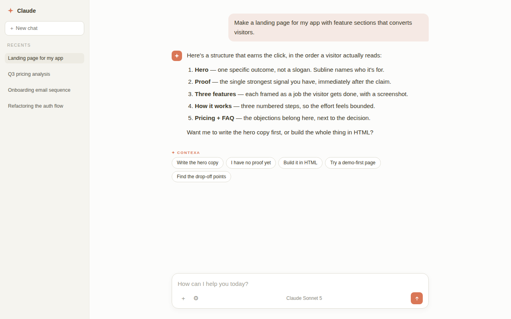

# CONTEXA

**CONTEXA reads Claude's reply and hands you your next message — the one Claude itself would ask you to send.**

CONTEXA is a Chrome extension for claude.ai. When Claude finishes a reply, CONTEXA reads it and offers up to five chips — each one a complete next message, written and ready to send. Click a chip and it lands in your composer; you read it, change anything, and send it yourself. Nothing is ever sent for you.

The chips aren't topic suggestions. They're the messages Claude would request if it could: paste the file it's been guessing about, settle the fork it hedged — "Assume X. Redo under exactly that." — invite its questions when the goal is still fuzzy, give it permission to stop listing options and build the full version, or turn the problem around entirely. Every chip must be earned by something the reply actually said; no quotable evidence, no chip. A reply blocked on one missing thing gets one chip, not five fillers. Under the hood, every chip follows the playbook good prompt engineers use — one component at a time, real content, tight scope — applied for you, one message at a time.

No account, no API key, free for up to twenty replies a day. Nothing overlays your composer, nothing scores your writing, and nothing appears unless it's real.



---

## Why it exists

Vague prompts get vague answers, and writing specific prompts is a skill. CONTEXA
reads the conversation you're already in and proposes the five moves a sharp
collaborator would suggest: going deeper on the valuable part, resolving what the
reply assumed, producing the actual artifact, trying a different framing, or
pressure-testing the result.

The chips stay under five words so you can scan them in a second. The prompt
behind each one is detailed — it names the deliverable, the format, the length,
the constraint. The composer is the disclosure surface: you always see the full
text before anything is sent.

## Repo layout

```
extension/    Chrome extension (Manifest V3) — this is the product
worker/       Cloudflare Worker backend — proxies to Anthropic, enforces quotas
publishing/   Chrome Web Store listing copy, privacy policy, screenshots, checklist
```

## How it works

```
claude.ai reply finishes
   └─ content.js detects [data-is-streaming] flipping to false
        └─ sends your last message + the reply to the backend
             └─ Worker adds the system prompt, calls Anthropic, enforces quota
                  └─ five {label, text} pairs render as chips
                       └─ click → full prompt inserted into the composer
```

Two modes:

- **Hosted (default)** — the Worker holds the API key, so users need no setup.
  Fair-use limit of 20 replies/day per device.
- **Own API key (optional)** — set it in the extension's options to remove the
  limit. Requests then go straight from the browser to Anthropic, bypassing the
  Worker entirely.

## Install the extension (development)

1. `chrome://extensions` → enable **Developer mode**
2. **Load unpacked** → select the `extension/` folder
3. Open claude.ai and send a message

Chrome will warn that it "can't verify where this extension comes from." That's
expected for unpacked extensions and only goes away when installing from the
Chrome Web Store.

## Deploy the backend

Full instructions in [`worker/README.md`](worker/README.md). Short version:

```bash
cd worker
npx wrangler login
npx wrangler kv namespace create CX_KV     # paste the id into wrangler.toml
npx wrangler deploy
npx wrangler secret put ANTHROPIC_API_KEY  # value goes in at the prompt
npx wrangler secret put IP_SALT
curl https://YOUR-WORKER-HOST/v1/health    # {"ok":true,"limit":20,"configured":true}
```

On Windows PowerShell use `npx.cmd` and `curl.exe`, and generate the salt with
`[guid]::NewGuid().ToString('N')`.

Then set `DEFAULT_PROXY_URL` in `extension/background.js` and the matching entry
in `extension/manifest.json`'s `host_permissions`.

### Secrets

The Anthropic key lives **only** in Cloudflare's encrypted secret store — never
in this repo, never in the extension. `wrangler secret put` takes the secret
*name* as its argument and the *value* at a hidden prompt; inverting those two
creates a secret literally named after your key, so prefer the Cloudflare
dashboard (**Settings → Variables and Secrets**) where the field is visible.

## Cost and abuse controls

Roughly **$0.004 per suggestion set** (~2,000 input tokens, ~400 output, Haiku).
100 active users at 20 replies/day is about **$240/month**.

Built-in protections:

- 20 requests/day per device token, 60/day per hashed IP
- Server-side input clamping (prompt ≤2,500 chars, reply ≤6,000, fixed
  `max_tokens`) — a modified client cannot make a request cost more
- Replies under 50 characters are rejected before any upstream call
- Upstream error bodies are never forwarded to clients

A spend limit in the Anthropic console is the only hard ceiling. Set one.

## Privacy design

- Runs only on claude.ai.
- Sends only your latest message and the reply just received — never history,
  other conversations, or account details.
- Conversation text is never stored.
- The device token is random and anonymous; it is not derived from you, your
  profile, or your account. It exists solely to apply a daily limit.
- IP addresses are stored only as salted SHA-256 hashes.
- No accounts, analytics, tracking, or ads.

Full policy: [`publishing/PRIVACY.md`](publishing/PRIVACY.md)

## Design notes

Things learned the hard way, kept deliberately:

- **Never fake output.** Earlier builds silently fell back to three canned
  suggestions when the API failed, which made a broken integration look like a
  working one. Degraded states now state the actual reason.
- **The chip is a handle, not the prompt.** A five-word prompt ("fix the pricing
  section") is one you could have written yourself and forces Claude to guess.
  Short label, specific payload.
- **No categories or personas.** An earlier version tagged suggestions by lens
  (sharpen / explore / constrain). It made the output feel like a taxonomy
  exercise instead of a colleague talking.
- **Selectors degrade quietly.** If claude.ai's DOM changes, the extension goes
  silent rather than breaking the page. Relevant constants live at the top of
  `content.js`.

## Publishing

See [`publishing/PUBLISHING-CHECKLIST.md`](publishing/PUBLISHING-CHECKLIST.md).
Two known review risks are called out there: implied affiliation (which is why
"Claude" is deliberately absent from the extension's *name*) and the data
handling disclosures required when transmitting personal communications.

Screenshots in `publishing/screenshots/` were captured from the real extension
running against a local mock page — **retake them on real claude.ai before
submitting.**

## Status

Working: suggestions, hosted backend, quotas, own-key mode, light/dark.

Not built: prompt library and templates with variables, cross-device sync
(which needs real accounts, since device tokens are anonymous by design).

## Licence

MIT — see [LICENSE](LICENSE).

CONTEXA is an independent project. It is not affiliated with, endorsed by, or
sponsored by Anthropic.
