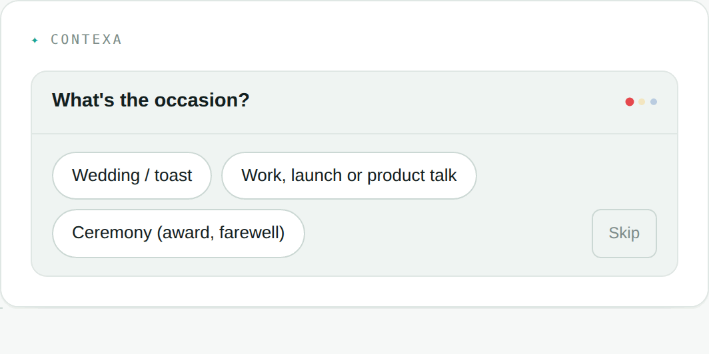

# CONTEXA

[](https://github.com/33kain/contexa/actions/workflows/ci.yml)

**CONTEXA reads Claude's reply and writes your next message — by asking you a few
short questions you answer by clicking.**



CONTEXA is a Chrome extension for claude.ai. When Claude finishes a reply, a
single chip appears above your message box. **Nothing happens until you click
it** — no model call, and nothing about your conversation leaves the page. Click
it and CONTEXA reads the exchange and asks you up to four short questions, one at
a time, **with the answers already written for you**. Pick one, or skip it. When
you're done it composes the whole prompt into your message box. You read it,
change anything, and send it yourself. Nothing is ever sent for you.

The questions aren't a survey. They're the decisions the reply actually left
open — the branch it hedged, the format it guessed at, the thing it asked you
for. Every question must be earned by something the reply said; **no quotable
evidence, no question.** A reply that left nothing worth asking earns nothing,
and the row stays quiet. That is a correct outcome, not a failure.

When the conversation already settles something, CONTEXA writes it down as an
editable `Assume:` line instead of asking you about it.

No account, no API key, free to use. Nothing overlays your composer, nothing
scores your writing, and nothing appears unless it's real.

---

## Why it exists

Vague prompts get vague answers, and writing specific prompts is a skill. The
audience is people who are already using Claude every day and are not
developers — *"make bad prompts good"* is worth nothing to someone whose prompts
are already good.

So CONTEXA doesn't grade your writing. It reads the conversation you're already
in, works out what the reply left undecided, and turns that into a couple of
clicks. The composed prompt is detailed — it names the deliverable, the format,
the length, the constraint — and **the message box is the disclosure surface:**
you always see the full text before anything is sent.

## Repo layout

```
extension/    Chrome extension (Manifest V3) — this is the product
worker/       Cloudflare Worker backend — proxies to Anthropic, enforces quotas
publishing/   Chrome Web Store listing copy, privacy policy, screenshots, checklist
```

## How it works

```
claude.ai reply finishes
   └─ content.js detects [data-is-streaming] flipping to false
        └─ captures your last message + the reply, and STOPS
             └─ renders one chip. No model call. Nothing sent.

you click the chip
   └─ the captured pair goes to the backend
        └─ Worker adds the system prompt, calls Anthropic, enforces quota
             └─ questions earned  → interview card, one question at a time
                nothing asked but
                something settled  → one-click compose, with an "Assume:" line
                nothing at all     → the box opens so you can type it yourself
                  └─ the composed prompt lands in your message box
```

**The capture is eager; the call is not.** Reading the page costs nothing and the
DOM is settled the moment a reply completes, so that still happens immediately.
The model call — the part that costs money and sends data — waits for a click.

Two modes:

- **Hosted (default)** — the Worker holds the API key, so users need no setup.
  Fair-use limit of 40 calls/day per device. An interview spends two (one to
  write the questions, one to compose), so the honest number is **20 prompts a
  day** — `PROMPTS_PER_DAY` in `worker/src/index.js`, which is the one figure
  safe to quote in public copy.
- **Own API key (optional)** — set it in the extension's options to remove the
  limit. Requests then go straight from the browser to Anthropic, bypassing the
  Worker entirely.

## Install the extension (development)

1. `chrome://extensions` → enable **Developer mode**
2. **Load unpacked** → select the `extension/` folder
3. Open claude.ai and send a message

Chrome will warn that it "can't verify where this extension comes from." That's
expected for unpacked extensions and only goes away when installing from the
Chrome Web Store.

**Reloading the extension does not update open tabs.** Reload it, then Ctrl+R
every claude.ai tab, or you are testing an orphaned copy of the old build. The
mount log says which version you are actually running:

```
[CONTEXA] card mounted v0.9.53 ai anchor top=… bottom=… viewport=… connected=…
```

`v?` there means an orphaned script. Two mount lines with different versions
means two builds installed at once.

## Deploy the backend

Full instructions in [`worker/README.md`](worker/README.md). Short version:

```bash
cd worker
npx wrangler login
npx wrangler kv namespace create CX_KV     # paste the id into wrangler.toml
npx wrangler deploy
npx wrangler secret put ANTHROPIC_API_KEY  # value goes in at the prompt
npx wrangler secret put IP_SALT
curl https://YOUR-WORKER-HOST/v1/health    # {"ok":true,"limit":20,"configured":true}
```

On Windows PowerShell use `npx.cmd` and `curl.exe`, and generate the salt with
`[guid]::NewGuid().ToString('N')`.

Then set `DEFAULT_PROXY_URL` in `extension/background.js` and the matching entry
in `extension/manifest.json`'s `host_permissions`.

### Secrets

The Anthropic key lives **only** in Cloudflare's encrypted secret store — never
in this repo, never in the extension. `wrangler secret put` takes the secret
*name* as its argument and the *value* at a hidden prompt; inverting those two
creates a secret literally named after your key, so prefer the Cloudflare
dashboard (**Settings → Variables and Secrets**) where the field is visible.

## Cost and abuse controls

**Cost scales with asks, not with replies.** Before the on-demand change every
completed reply spent a call whether or not anyone looked at it — `bumpQuota`
sits in the shared gate ahead of the endpoint split, so writing the questions
charges the pool exactly like composing does. A long conversation could exhaust
a day's free tier without a single click. Now nothing is spent until someone
asks, which is the only place the spend was ever buying anything.

Built-in protections:

- 40 requests/day per device token (= `PROMPTS_PER_DAY × 2`), 400/day per hashed
  IP (= the device ceiling × 10). All three are derived from one another in
  `worker/src/index.js` rather than written down separately, because the last
  time they were separate literals the ratio silently halved when the device
  ceiling moved.
- Server-side input clamping (prompt ≤2,500 chars, reply ≤6,000, fixed
  `max_tokens`) — a modified client cannot make a request cost more
- Very short replies are rejected before any upstream call
- Upstream error bodies are never forwarded to clients

A spend limit in the Anthropic console is the only hard ceiling. Set one.

## Privacy design

- Runs only on claude.ai.
- **Nothing is sent until you click.** A reply you never ask about never leaves
  the page at all.
- Sends only your latest message and the reply just received — never history,
  other conversations, or account details.
- Conversation text is never stored.
- The device token is random and anonymous; it is not derived from you, your
  profile, or your account. It exists solely to apply a daily limit.
- IP addresses are stored only as salted SHA-256 hashes.
- No accounts, analytics, tracking, or ads.

Full policy: [`publishing/PRIVACY.md`](publishing/PRIVACY.md)

## Design notes

Things learned the hard way, kept deliberately:

- **Zero is a product outcome.** Nothing earned, nothing said. There is no floor,
  no fallback suggestion and no minimum count — and no ceiling either. Every
  failure class this project has recorded came from something that guaranteed a
  non-empty row.
- **Never fake output.** Earlier builds silently fell back to canned suggestions
  when the API failed, which made a broken integration look like a working one.
  Degraded states state the actual reason.
- **The interview is click-only.** A question that can't be reduced to options is
  dropped, not softened into a text field. Material you have to supply becomes a
  `<paste here>` slot in the composed prompt instead.
- **One prompt, one verb.** If a bullet could be sent on its own as a complete
  request, it's a second job and it doesn't belong.
- **No categories or personas.** An earlier version tagged suggestions by lens
  (sharpen / explore / constrain). It made the output feel like a taxonomy
  exercise instead of a colleague talking.
- **Selectors degrade quietly.** If claude.ai's DOM changes, the extension goes
  silent rather than breaking the page. Relevant constants live at the top of
  `content.js`.
- **Two controls must never share a label.** The trigger and the type-it-yourself
  chip can appear in the same row and do different things. Star asks, pencil
  types.

## Publishing

See [`publishing/PUBLISHING-CHECKLIST.md`](publishing/PUBLISHING-CHECKLIST.md).
Two known review risks are called out there: implied affiliation (which is why
"Claude" is deliberately absent from the extension's *name*) and the data
handling disclosures required when transmitting personal communications.

**Screenshots in `publishing/screenshots/` are from the chip era and show a
product that no longer exists.** Retake them against the current build before
submitting.

## Status

Working: the on-demand trigger, the click-only interview, `Assume:` lines,
hosted backend, quotas, own-key mode, light/dark, scroll-away, mobile via
Chromium browsers that support extensions.

Not built: prompt library and templates with variables, cross-device sync
(which needs real accounts, since device tokens are anonymous by design).

## Licence

MIT — see [LICENSE](LICENSE).

CONTEXA is an independent project. It is not affiliated with, endorsed by, or
sponsored by Anthropic.
